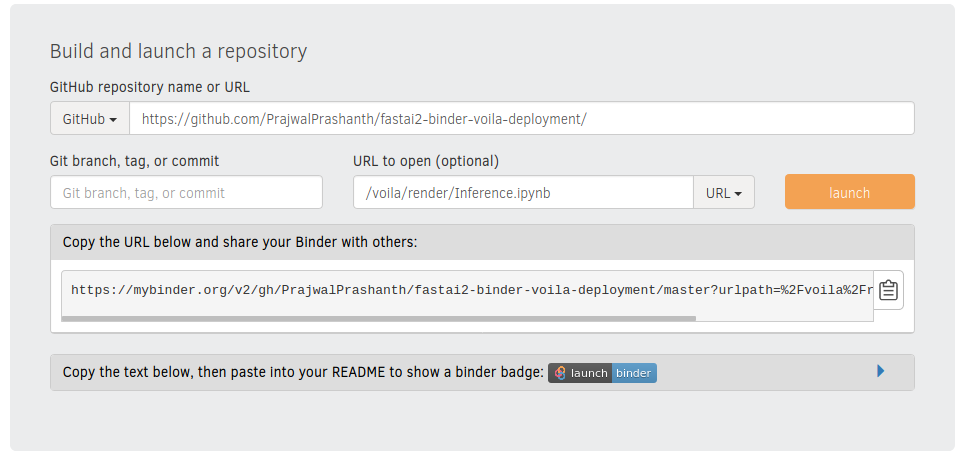

# fastai2-binder-voila-deployment

 

## Steps to create your own project
1) Train a Deep learning model based of custom dataset as shown in this [Jupyter Notebook](https://jovian.ml/PrajwalPrashanth/fastai2-chapter2). You'll be getting a here `export.pkl` file, once you have trained your which is needed.
2) Fork this repo and replace the `export.pkl` file, and change the markdown cell the in the `Inference.ipynb` file for custom text and images.
3) Visit mybinder.org  
- Replace your Repository Link
- Choose `URL` in the dropdown instead of `File`
- Incase you have made the change to `Inference.ipynb` do that change in the URL as well.
- Copy the link so that you can share that
4) Click on Lauch, doing it for the first time will take time as it will install the dependencies from `requirements.txt` file.

Note: This method is just for prototyping and will not run as a service for ever, binder is a free service and will end the isntance with inactivity. Please make sure you launch it once before sharing the link.

Credits to the [FastAi Team](https://fast.ai), [example repo by fastai](https://github.com/fastai/bear_voila) 
